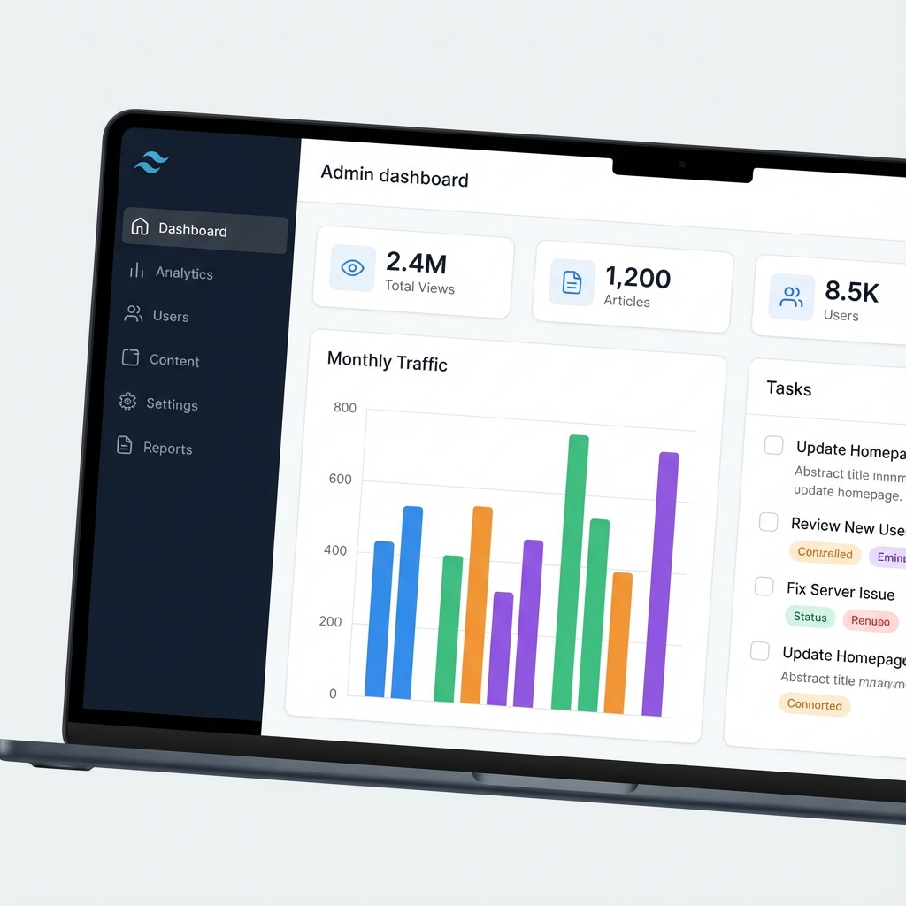

# DeepBlog CMS 🚀

A powerful, modern, and SEO-optimized Content Management System built with **Laravel**. Designed for performance, security, and ease of use.



## ✨ Key Features

### 🛡️ Admin & System Management
- **Professional Dashboard**: Data-rich overview with `Chart.js` visualizations, real-time stats, and activity feeds.
- **Backup & Restore System**:
  - **One-Click Backup**: Download full database dumps (`.sql`) directly from the admin panel.
  - **Restore**: Upload and restore database backups easily.
  - **Reset Data**: "Danger Zone" feature to wipe content while preserving users and pages.
- **Organized Sidebar**: Grouped navigation for Content, Community, and System settings.
- **Improved Search**: Functional search for Articles in the admin panel.

### 🔍 SEO & Social Media (Optimization Suite)
- **Breadcrumbs Navigation**:
  - Visual navigation (`Home > Category > Article`) for better UX.
  - **Schema.org JSON-LD** integration for Google Rich Snippets.
- **Social Media Ready**:
  - **Open Graph (Facebook)** and **Twitter Card** meta tags automatically generated for every page.
  - Link sharing displays featured images, titles, and descriptions correctly.
- **Sitemap**: XML Sitemap generation included.

### ⚡ Performance "Turbo Mode"
- **Caching System**:
  - **Homepage Cache**: Banners, Trending, and Latest news cached for 10 minutes to minimize database queries.
  - **Admin Stats Cache**: Dashboard statistics cached for 5 minutes for instant loading.
- **Optimized Queries**: Eager loading (`with()`) used throughout to prevent N+1 query issues.

### 🔒 Security
- **Anti-Spam (Honeypot)**: Hidden `website_catch` field in comment forms to silently trap and block bots without CAPTCHA.
- **Security Headers Middleware**: Custom middleware adding `X-Frame-Options`, `X-XSS-Protection`, and `Referrer-Policy` to protect against attacks.
- **Role-Based Access**: Secure admin middleware protecting sensitive routes.

### 🎨 Frontend Experience
- **Modern UI**: Clean, responsive design for Articles, Categories, and Static Pages.
- **All Categories Page**: Dedicated page with glassmorphism-style cards for category exploration.
- **Maintenance Mode**: Custom 503 page with professional styling.

## 🛠️ Installation

1. **Clone the repository**
   ```bash
   git clone https://github.com/yourusername/cms-blog-new.git
   cd cms-blog-new
   ```

2. **Install Dependencies**
   ```bash
   composer install
   npm install && npm run build
   ```

3. **Environment Setup**
   ```bash
   cp .env.example .env
   php artisan key:generate
   ```
   *Configure your database settings in `.env`*

4. **Migrate & Seed**
   ```bash
   php artisan migrate --seed
   ```

5. **Run the Server**
   ```bash
   php artisan serve
   ```

## 📖 Usage Guide

### Backup & Restore
Navigate to **System > Backup** in the Admin Sidebar.
- Click **Download DB** to save a snapshot.
- To restore, upload a `.sql` file in the Restore section. **Warning:** This overwrites the current database.

### Maintenance Mode
To enable maintenance mode with the new design:
```bash
php artisan down --secret="your-secret-key"
```

## 📝 License
This project is open-sourced software licensed under the [MIT license](https://opensource.org/licenses/MIT).
